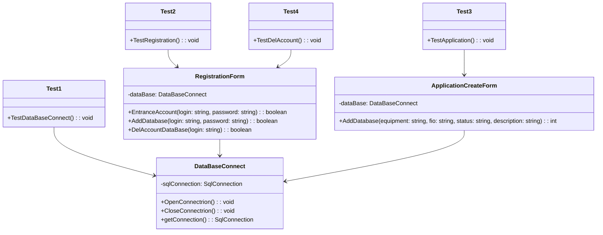

```mermaid
classDiagram
    class DataBaseConnect {
        -sqlConnection: SqlConnection
        +OpenConnectrion(): void
        +CloseConnectrion(): void
        +getConnection(): SqlConnection
    }
    class RegistrationForm {
        -dataBase: DataBaseConnect
        +EntranceAccount(login: string, password: string): boolean
        +AddDatabase(login: string, password: string): boolean
        +DelAccountDataBase(login: string): boolean
    }
    class ApplicationCreateForm {
        -dataBase: DataBaseConnect
        +AddDatabase(equipment: string, fio: string, status: string, description: string): int
    }
    class Test1 {
        +TestDataBaseConnect(): void
    }
    class Test2 {
        +TestRegistration(): void
    }
    class Test3 {
        +TestApplication(): void
    }
    class Test4 {
        +TestDelAccount(): void
    }

    Test1 --> DataBaseConnect
    Test2 --> RegistrationForm
    Test3 --> ApplicationCreateForm
    Test4 --> RegistrationForm
    RegistrationForm --> DataBaseConnect
    ApplicationCreateForm --> DataBaseConnect
```